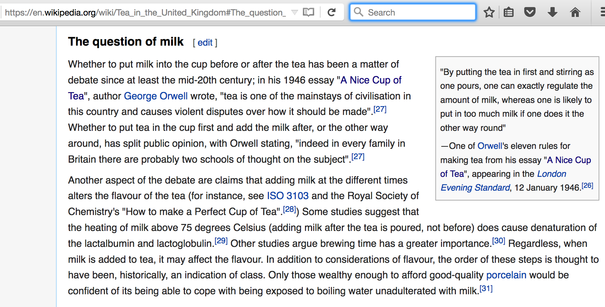

```{r setup, include=FALSE}
knitr::opts_chunk$set(echo = TRUE)
```

# The Lady Tasting Tea

##

 


## English Garden Party


## R.A. Fisher

 


## The Experiment {.build}

A lady declares that by tasting a cup of tea made with milk she can discriminate whether the milk or the tea infusion was first added to the cup. We will consider the problem of designing an experiment by means of which this assertion can be tested. […] [It] consists in mixing eight cups of tea, four in one way and four in the other, and presenting them to the subject for judgment in a random order. The subject has been told in advance of that the test will consist, namely, that she will be asked to taste eight cups, that these shall be four of each kind […]. — Fisher, 1935.


## A Hypothesis Test {.build}

**Claim**: I can tell the difference in taste when the milk was poured into the
tea and when the tea was poured into the milk.

**Approach**: I can assert a *null hypothesis* that the lady cannot tell the 
difference then I can see how probable the observed data (or more extreme) would be if she cannot tell (the p-value).

#

## 

Draw a picture of the distribution of $X$ in the following circumstances (each
holding the other parameters fixed at their original values).

1. Increase $N$ from 8 to 9
2. Increase $n$ from 4 to 5
3. Decrease $r$ from 4 to 3