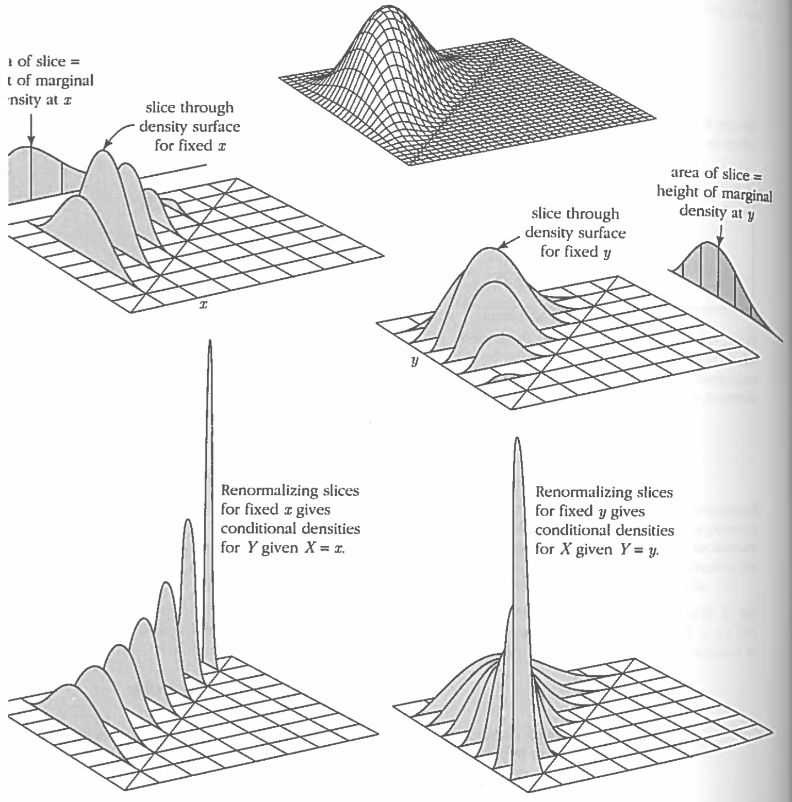

---
output:
  html_document:
    toc: true
    toc_float: true
    code_folding: hide
---

```{r setup, include=FALSE}
knitr::opts_chunk$set(echo = TRUE)
```

### Joint Density Functions

We can visualize part of the following joint density function using as a 3D surface.

$$
f(x, y) = 6e^{-2x- 3y} \quad \quad (x, y > 0)
$$

```{r}
f <- function(x, y) {
  6 * exp(-2 * x - 3 * y)
}

dx <- .1
dy <- .1
x <- seq(0, 3, by = dx)
y <- seq(0, 3, by = dy)
z <- outer(x, y, f)
persp(x, y, z, theta = 25, phi = 25)
```

## Marginal Probabilities

We can visualize the process of integrating out $x$ to get $f_Y(y)$.

```{r}
fy <- colSums(z)
plot(y, fy, pch = 16)
lines(y, fy, col = "tomato", lwd = 2)
```

And equivalently for $f_X(x)$
```{r}
fx <- rowSums(z)
plot(y, fy, pch = 16)
lines(y, fy, col = "tomato", lwd = 2)
points(x, fx, pch = 16)
lines(x, fx, col = "steelblue", lwd = 2)
```

## Cumulative Density Functions

For our same joint pdf, we can consider the joint cdf.

$$
F(x, y) = \int_{s = 0}^x \int_{t = 0}^y 6 e^{-2s - 3t} dt ds
$$
This function has the following shape:

```{r}
Fxy <- function(x, y) {
  exp(-3*y - 2*x) - exp(-2*x) - exp(-3*y) + 1
}
w <- outer(x, y, Fxy)
persp(x, y, w, theta = 25, phi = 25)
```


## Relatively constrained probabilities

We wish to compute the following probability.

$$
P(X > 2Y) = P(Y < \frac{1}{2}X)
$$
We can visualize the set over which we wish to integrate,

```{r}
zconstrained <- z
for(i in 1:nrow(zconstrained)) {
  for(j in floor(.5*i):ncol(zconstrained)){
    zconstrained[i, j] <- 0
  }
}
persp(x, y, zconstrained, theta = 25, phi = 25)
```

and we can approximate the volume using the discrete sum.

```{r}
sum(zconstrained * dx * dy)
```

Or alternatively by taking the mean density of the points on the grid times the
area under integration.

```{r}
mean(zconstrained[zconstrained > 0])*9/4
```


### Monte Carlo Integration (Accept-Reject)


```{r}
n <- 1e6
x <- rexp(n, rate = 2)
y <- rexp(n, rate = 3)
mean(y<.5*x)
```

#### Correlation/Covariance

Because $X$ is independent of $Y$, we know that the covariance and correlation
are zero. If we simulate from $f(x,y)$, we can compute this approximately.

```{r}
cov(x, y)
cor(x, y)
```


## Geometry of Dependence



